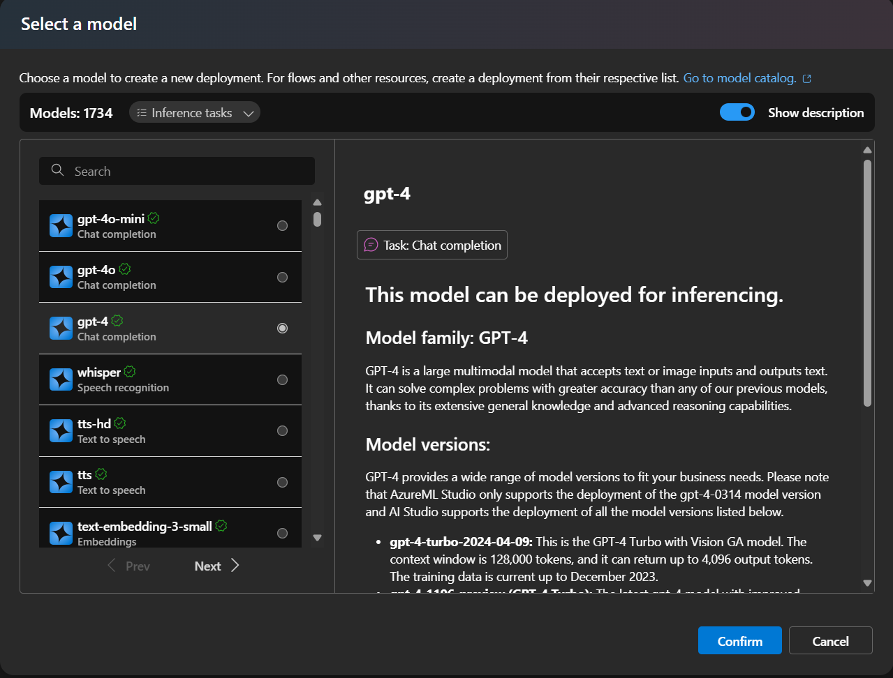
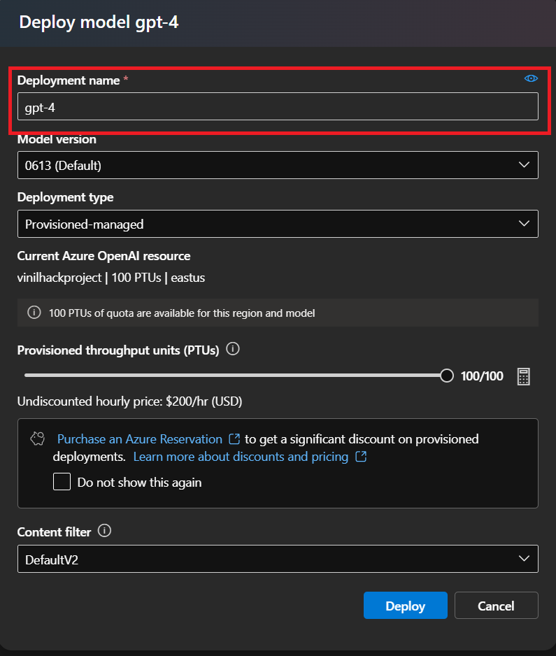

# Nexis – Your Smart CLI Assistant

## Description
Nexis is an innovative CLI-based tool designed to address the challenges faced by HPC and AI engineers. By leveraging the power of AI, Nexis transforms the traditional CLI experience into an intelligent and interactive support system.


Engineers in HPC and AI domains often face difficulties when dealing with:
- **Troubleshooting**: Identifying and resolving issues can be time-consuming and complex, requiring engineers to sift through extensive logs and documentation.
- **Coding Assistance**: Writing and debugging code in a traditional CLI environment can be cumbersome without immediate, context-aware support.
- **Information Retrieval**: Gathering relevant information from vast amounts of documentation and logs can be inefficient and error-prone.

Current CLI tools lack dynamic support and interactive features that could enhance problem-solving and efficiency. There is a clear need for a tool that integrates AI capabilities to streamline these tasks.

## Pre-requisites
1. Python 3.8 or higher
2. Valid Azure Subscription
3. Azure OpenAI subscription
4. Tested on Ubuntu 20.04, Ubuntu 22.04 & AlmaLinux 8.7

## Setup Instructions

### 1. Create Azure OpenAI Service
Login to the [Azure Portal](https://portal.azure.com/) and create an Azure OpenAI service. 


Obtain the Keys and Endpoint from the resource management section. This information is needed to build Nexis.


### 2. Configure `openai_config.json`
Create an `openai_config.json` file in your home directory with the obtained information:
```json
{
    "api_base": "https://nexisproject.openai.azure.com/",
    "api_version": "2023-03-15-preview",
    "api_key": "your-api-key",
    "deployment_name": "gpt-35-turbo"
}
```

### 3. Deploy Base Model in Azure AI Studio
Login to [Azure AI Studio](https://ai.azure.com/) and deploy a Base model for Nexis:
- Go to the deployment option.
- Select Deploy model → Select model → Select gpt-35-turbo and confirm.
- Update the deployment name in `openai_config.json` if necessary.





### 4. Install Nexis
Clone the repository, change the directory, and set up Nexis:
```bash
git clone https://github.com/vinil-v/nexis.git
cd nexis/
chmod +x setup_nexis.py
./setup_nexis.py
```
Note: In RHEL-based systems like AlmaLinux, ensure the shebang (`#!/usr/bin/env python3.8`) in both `nexis` and `setup_nexis.py` scripts points to Python 3.8. Additionally, run `pip3.8 install --user openai==0.28` if needed.

### 5. Run Nexis
Ensure the `openai_config.json` file is in the home directory. Run Nexis using the following command:
```bash
nexis
```

## Example Usage

### Help Command
```bash
root@hackmachine2:~# nexis -h
Note: This response is generated by an AI-based model.
Warning: Verify the information and use it as a guideline. AI-generated responses may not always be accurate or complete.
usage: nexis [-h] {ib,gpu,slurm,openpbs,mpi,scripts,logs,vmsku,error,others,linux,ai} query
Generate Nexis response using Azure OpenAI Service

positional arguments:
  {ib,gpu,slurm,openpbs,mpi,scripts,logs,vmsku,error,others,linux,ai}
                        Nexis response
  query                 The query to generate a response for

optional arguments:
  -h, --help            show this help message and exit
```

### Generate SLURM Job Script
```bash
root@hackmachine2:~# nexis slurm "create a job script for testing slurm job scheduling in 2 nodes"
Note: This response is generated by an AI-based model.
Warning: Verify the information and use it as a guideline. AI-generated responses may not always be accurate or complete.
Response:
#!/bin/bash
#SBATCH --job-name=test_slurm
#SBATCH --nodes=2
#SBATCH --ntasks-per-node=1
#SBATCH --mem-per-cpu=512M
#SBATCH --time=0-00:02:00
#SBATCH --output=test_slurm_%j.out
#SBATCH --error=test_slurm_%j.err
#SBATCH --mail-type=ALL
#SBATCH --mail-user=your-email-address@domain.com

# load modules
module load slurm

# Add test task here
echo "Hello World"
sleep 10

# End of job script
```

### Generate Tensorflow MNIST Code
```bash
vinil@hackmachine2:~$ nexis ai "write a sample mnist code using tensorflow"
Note: This response is generated by an AI-based model.
Warning: Verify the information and use it as a guideline. AI-generated responses may not always be accurate or complete.
Response:
import tensorflow as tf

mnist = tf.keras.datasets.mnist
(x_train, y_train), (x_test, y_test) = mnist.load_data()

x_train, x_test = x_train / 255.0, x_test / 255.0

model = tf.keras.models.Sequential([
    tf.keras.layers.Flatten(input_shape=(28, 28)),
    tf.keras.layers.Dense(128, activation='relu'),
    tf.keras.layers.Dropout(0.2),
    tf.keras.layers.Dense(10)
])

model.compile(optimizer='adam',
              loss=tf.keras.losses.SparseCategoricalCrossentropy(from_logits=True),
              metrics=['accuracy'])

model.fit(x_train, y_train, epochs=5)
model.evaluate(x_test, y_test, verbose=2)
```

### Check NVIDIA GPU Usage
```bash
root@hackmachine2:~# nexis gpu "how to check nvidia gpu usage via command line in linux"
Note: This response is generated by an AI-based model.
Warning: Verify the information and use it as a guideline. AI-generated responses may not always be accurate or complete.
Response:
To check the usage of your Nvidia GPU via command line in Linux, you can use the `nvidia-smi` command. This command provides real-time information about your GPU's performance, including utilization, temperature, and memory usage. To use the `nvidia-smi` command, simply open a terminal and enter the following command:

`nvidia-smi`

This will display a table of real-time information about your GPU's performance. You can use this information to monitor your GPU's performance, troubleshoot issues, or optimize your system for better performance. Additionally, you can use other command line tools, such as `htop` or `top`, to monitor your GPU's performance alongside other system resources.

Overall, checking your Nvidia GPU usage via command line in Linux is a simple and straightforward process that can help you optimize your system for better performance. Whether you're a gamer, researcher, or developer, monitoring your GPU's performance is essential to getting the most out of your system. So if you're looking to check your Nvidia GPU usage in Linux, give the `nvidia-smi` command a try and see what insights you can uncover.
```

Nexis simplifies troubleshooting, coding, and information retrieval by providing intelligent, AI-driven support directly through the command line. It is a valuable tool for HPC and AI engineers, streamlining their workflows and enhancing productivity.
 
